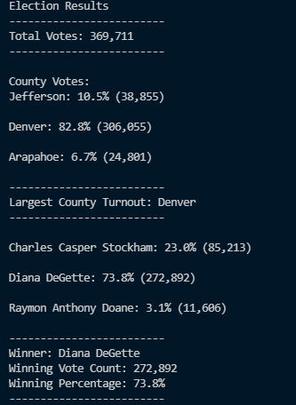
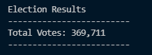
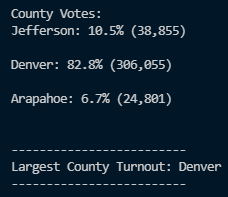
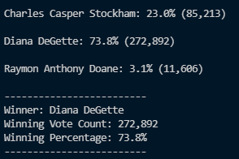

# Election Results Challenge

## Background and Overview
The purpose of this challenge is to count the total votes for a US congerssional district race in Colorado for the election comission. To do this we are using Python to read the csv files with the raw data on votes and then iterate through the data while keeping track of votes for candidates, as well as keeping track of the total votes counted in each county. Based on this data we are able to declare the winnner of the election as well as the larget voter turnout by county. This is done to show that Microsoft Excel is not the only platform that can be used to analyze raw data from csv files, and in fact may be more efficient in certain manners such as tracking votes by county and candidate.

## Election Audit Results

- This is exactly what is printed in the terminal after running the program, and what is currently written in the text file included in the "analysis" folder.

### Total Votes Cast

- As we can see here a total of 369,711 votes were cast which is also proven by double checking the csv file with Excel.

### County Results

- With over 80% of the total votes cast we can see Denver by far is the largest county included in this election data. 
- From this we can extrapolate that Denver had the largest voter turn out of all the counties included in this data set.

### Candidate Results

- The program not only returns a percentage of the total votes that each candidate recieves but also the exact amount of votes each recieved.
- It also determines the winner based on the highest number of votes; which in this case we can see is Diana DeGette with over 73% of the popular vote.

## Summary and Conclusions
We can see from the vote counts tabulated that Denver had by and far the largest hand in this election with over 80% of the vote. This matches with how Diana DeGette won with a large majority, presuming that Denver primarily voted for DeGette. As anybody can see the counting done by the program is quite well functioning and can easily be changed to match any other necessary metrics in other possible election results. For example in a senatorial race you can instead of counting votes by county, count them by congressional district. As long as the data is included in the raw data almost anything can be measured using this program with some refactored code. Another obvious use would be counting votes by let's say city council districts in city wide elections such as for mayor. Other local election could easily use their own metrics such as cities in county wide elections. All of these options only require refactoring the code to match the current data which would only take a minimal amount of time. Another benefit of the code is that it eliminates much of the human error that comes from manual doing the process via a program such as Excel.
